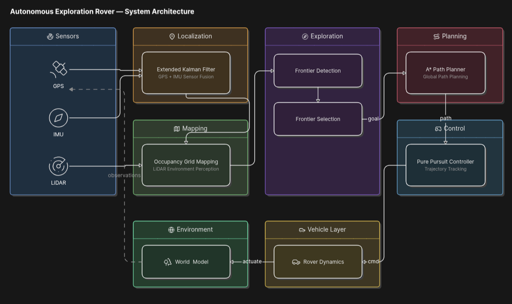
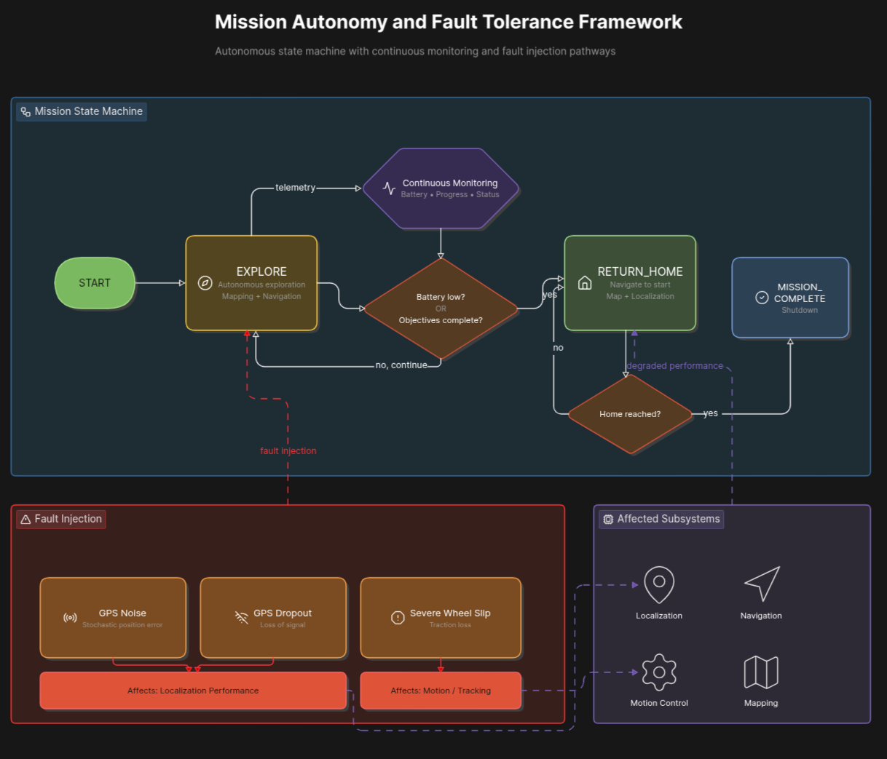
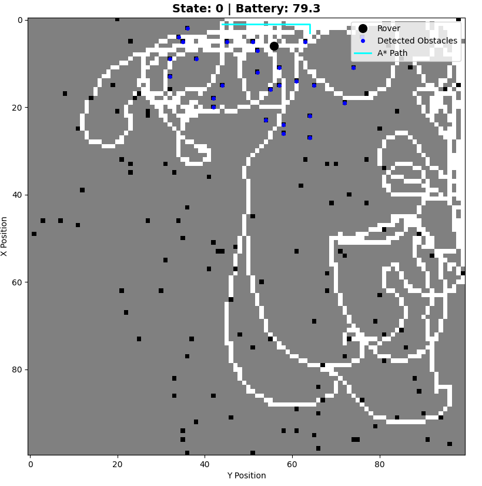
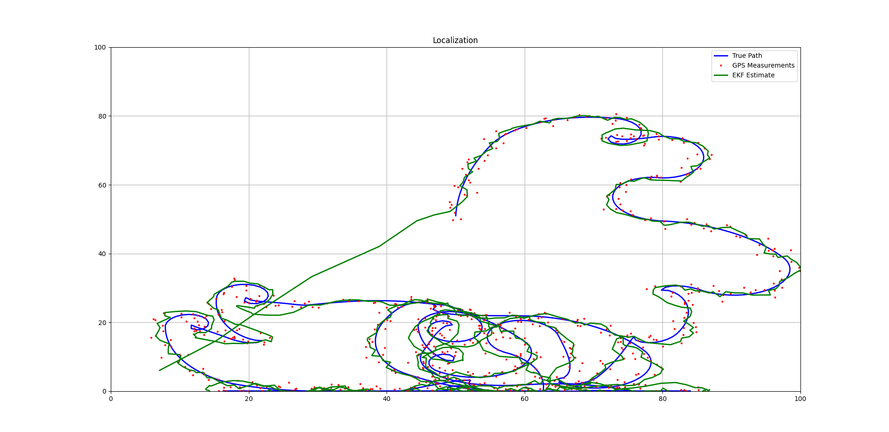
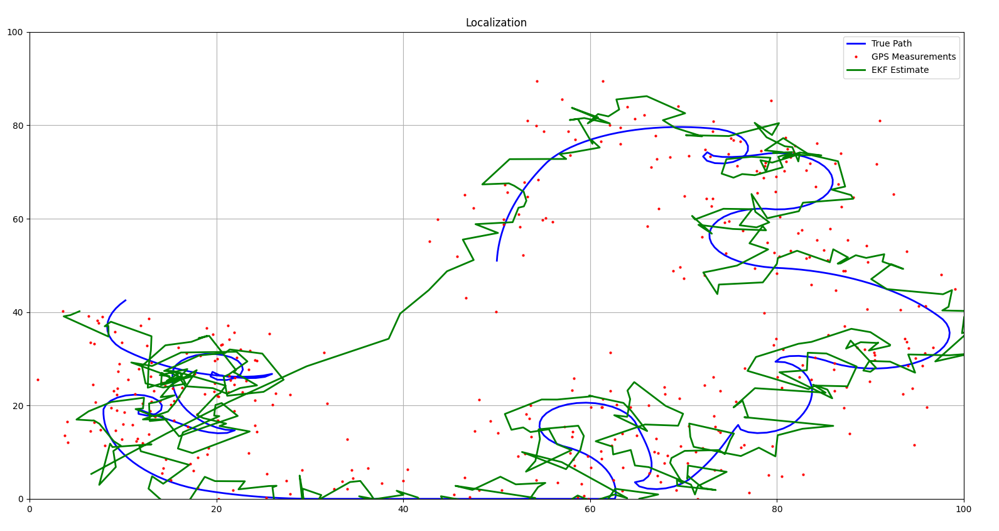
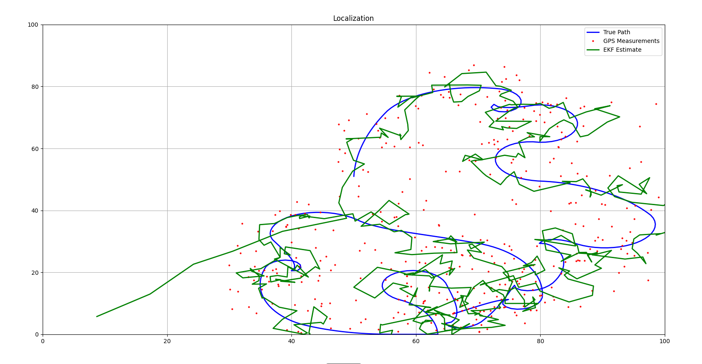
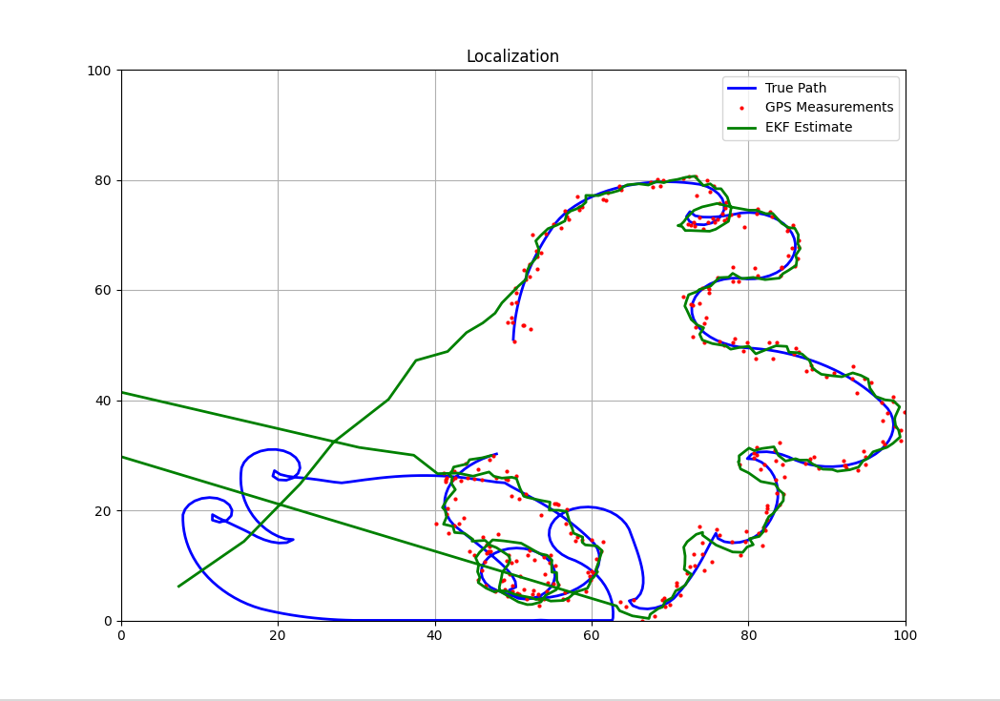
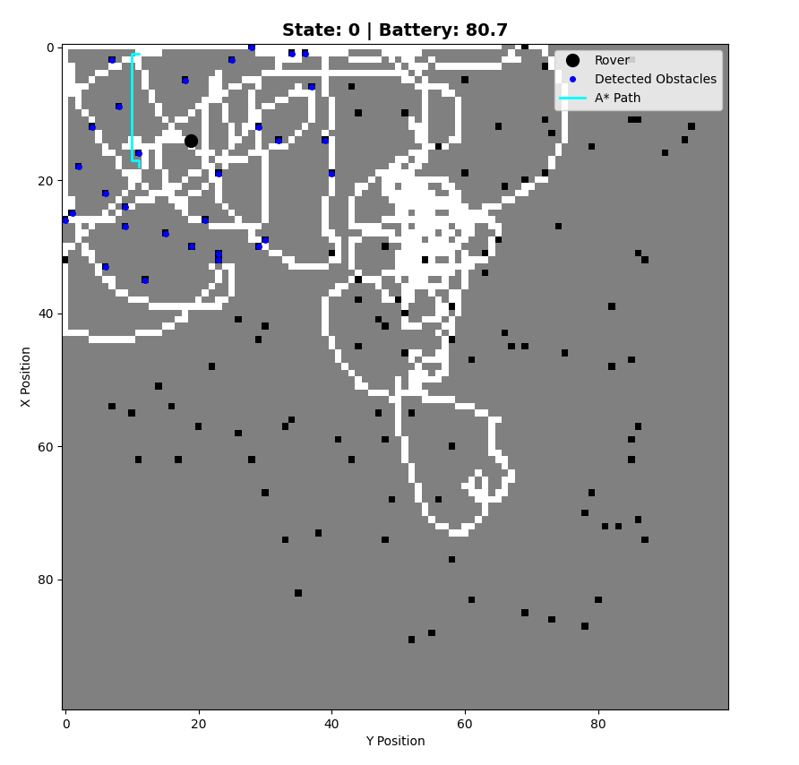
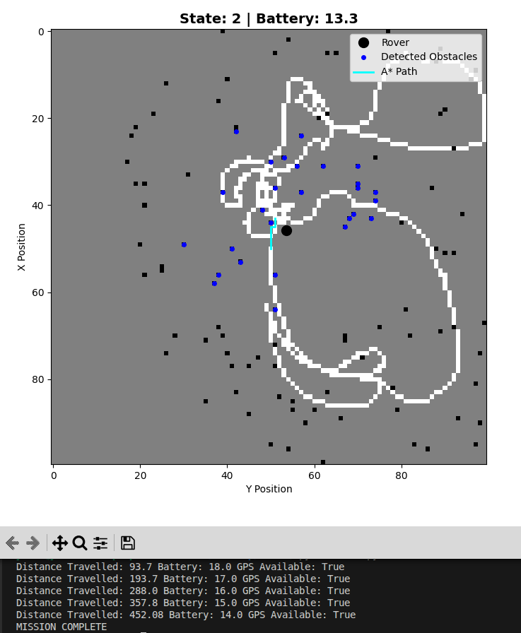

# Autonomous Planetary Rover Navigation and Exploration System

## Overview

This project implements a complete autonomous rover exploration stack capable of localizing itself, building a map of an unknown environment, planning paths, making exploration decisions, and handling sensor and mobility disturbances.

The rover operates in a simulated planetary environment containing obstacles, rough terrain, and crater regions. Using GPS, IMU, and LiDAR sensors, the rover incrementally constructs an occupancy grid map, identifies unexplored frontier regions, autonomously selects exploration goals, plans safe paths, and navigates through the environment.

The rover autonomously transitions between exploration, return-home, and mission-completion states based on mission progress and battery constraints.

The system also evaluates robustness under multiple fault conditions including GPS noise, GPS dropout, and severe wheel-slip disturbances.

---

# Autonomous Rover Navigation System

## System Architecture

The rover performs autonomous exploration using sensor fusion, occupancy grid mapping, frontier-based exploration, A* path planning, and Pure Pursuit control.

<p align="center">
  
</p>

---

## Mission Autonomy and Fault Tolerance

Mission execution is governed by a finite-state autonomy framework with fault injection scenarios used for robustness evaluation.

<p align="center">
  
</p>
## Project Highlights

- Extended Kalman Filter (EKF) localization
- GPS + IMU sensor fusion
- LiDAR-based Occupancy Grid Mapping
- Frontier-Based Autonomous Exploration
- A* Path Planning
- Pure Pursuit Path Tracking
- Mission-Level State Machine
- GPS Noise Fault Injection
- GPS Dropout Fault Injection
- Severe Wheel Slip Modeling
## Key Features

### Localization

* Extended Kalman Filter (EKF) sensor fusion
* GPS and IMU integration
* State estimation under noisy measurements

### Mapping

* Occupancy Grid Mapping
* Unknown, free, and occupied space representation
* Incremental map updates from LiDAR observations

### Autonomous Exploration

* Frontier Detection
* Frontier Selection
* Autonomous goal generation
* Exploration of unknown regions

### Path Planning

* A* Search Algorithm
* Obstacle-aware navigation
* Periodic replanning

### Control

* Pure Pursuit path tracking
* Proportional steering control
* Smooth waypoint following

### Mission-Level Autonomy

* EXPLORE state
* RETURN_HOME state
* MISSION_COMPLETE state
* Battery-aware decision making

### Fault Tolerance

* Increased GPS Noise
* GPS Dropout
* Severe Wheel Slip

---
## Core Algorithms

### Localization
- Extended Kalman Filter (EKF)

### Mapping
- Occupancy Grid Mapping

### Exploration
- Frontier Detection
- Frontier Selection

### Planning
- A* Search Algorithm

### Control
- Pure Pursuit Controller
- Proportional Steering Control
## Fault Injection Experiments

### GPS Noise

Additional Gaussian noise is injected into GPS measurements to evaluate localization robustness under degraded sensor quality.

### GPS Dropout

GPS measurements are temporarily disabled, forcing the EKF to rely on prediction and remaining sensor information.

### Severe Wheel Slip

Terrain-induced wheel slip is increased beyond nominal conditions, introducing discrepancies between commanded and realized rover motion.

---
## Experimental Evaluation Summary

| Scenario | Outcome |
|-----------|----------|
| Nominal Operation | Mission Completed Successfully |
| GPS Noise (σ=3) | Successful Localization |
| GPS Noise (σ=5) | Increased Localization Error |
| GPS Dropout | Mission Completed with Reduced Accuracy |
| Severe Wheel Slip | Increased Tracking Error |
## Experimental Evaluation

### Autonomous Exploration



The rover autonomously explores unknown regions using frontier-based exploration and incrementally constructs an occupancy map.

### Localization Performance



Comparison between:

* Ground Truth Trajectory
* GPS Measurements
* EKF Estimated Trajectory

### GPS Noise (σ = 3)



### GPS Noise (σ = 5)



### GPS Dropout



### Severe Wheel Slip



### Mission Completion



---

## Project Structure

```text
ROVER/

├── environment/
│   ├── mars_world.py
│   ├── obstacles.py
│   ├── terrain.py
│   └── costmap.py
│
├── estimation/
│   ├── localisation.py
│   └── ekf.py
│
├── mapping/
│   └── occupancy_grid.py
│
├── planning/
│   ├── frontier_planner.py
│   └── astar.py
│
├── intelligence/
│   └── mission_state.py
│
├── rover/
│   ├── sensors.py
│   ├── dynamics.py
│   ├── purepursuit.py
│   ├── slip_model.py
│   └── state.py
│
├── visualization/
│   ├── renderer.py
│   ├── rover_renderer.py
│   ├── path_renderer.py
│   └── trajectory_plotter.py
│
├── screenshots/
│
└── main.py
```
### Module Overview

| Module | Purpose |
|----------|----------|
| environment | Terrain, obstacles, world generation, cost maps |
| estimation | EKF-based localization and state estimation |
| mapping | Occupancy grid mapping |
| planning | Frontier exploration and A* path planning |
| intelligence | Mission autonomy and state machine |
| rover | Sensors, dynamics, control, and slip modeling |
| visualization | Rendering, path visualization, trajectory analysis |
```
```

## Technologies Used

* Python
* NumPy
* Matplotlib
* Extended Kalman Filter (EKF)
* Occupancy Grid Mapping
* A* Search Algorithm
* Pure Pursuit Control

---

## Future Work

* ROS2 Integration
* SLAM-based Localization and Mapping
* Multi-Robot Exploration
* Dynamic Obstacle Avoidance
* Hardware Deployment
* Model Predictive Control (MPC)

---

## Author

**Yuvan Ashrith**

Mechanical Engineering Undergraduate

University College of Engineering, Osmania University
